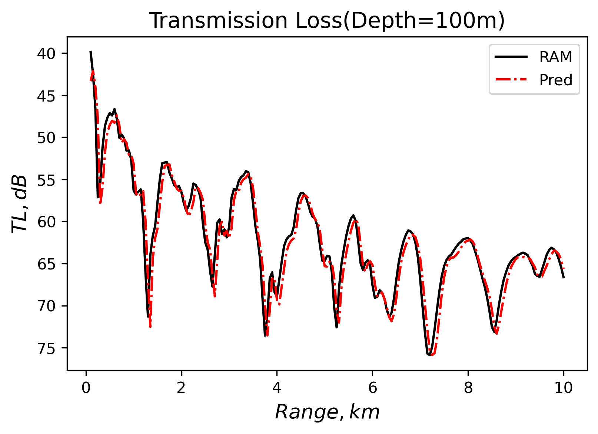

# Sound field information neural network
Sound field information predict with PINNs framwork
~~1. PDDO to include nonlocal feature~~ 
2. Split-stepping in horizontal direction, with parabolic equation code "RAM" as data-source
3. I dim that RAM is not a goog start because it's too difficult set the boundary...so i choose "KRAKEN"! 

## Table of Contents

1. [Overview](#Overview)
2. [Usage](#Usage)
3. [Features](#Features)
4. [Current Issues](#Current-Issues)
5. [Background](#Background)
6. [References](#References)

## Overview
~~project undone, hopeing i can finish it...~~  
My project scheduled in "Features".If i finish this project, i'll put features in here.  
I'll put the questions I feel stuck on me in "Current-Issues" and welcome your advice.  
I explain my project simplely in "Background".  

## Usage:
I rewrite my code in .ipynb, may be let it looks good.

## Features:
- [x] PDDO-PINN
- [x] PINN with slit-step data, “RAM” as data-source
- [ ] PINN, "kraken" as data-source

## Current Issues: 
I found there need two NN to set up a correct model, it's diffcult and i choose change my data-source to "KRAKEN"

## Background:  
This is because not all points have a large amplitude. Since PINN calculates the loss in a batch, perhaps replacing this batch with the Family calculation will give better results.  
I get real-pressure and image-pressure by other method.And choose Family with size [7,7].  
The point in the 49 black boxes is a batch.
>*Governing equations is Inhomogeneous Helmholtz equation.*  
>Dataset:Figure below is transmission of pressure with range and depth.  
>Ofcourse i split complex pressure in real-part and image-part.So there is two dataset.  

  

   

I no longer want to get the exact solution, my dataset is also an approximate solution.  

so I train vertically distributed networks and perform a stepwise solution for the one-way propagating sound field.  
Here is PINNs results, with *split-stepping method*(or i can't start trainning, LOSS always high):  

  

Figure right is error-pointwise,seems to be working with split-stepping.Part of near-field still not work.
It appears that the lower proximity amplitude results in the network not learning the mechanism, but with low loss.

## References：
1. Haghighat E, Bekar A C, Madenci E, et al. A nonlocal physics-informed deep learning framework using the peridynamic differential operator[J]. Computer Methods in Applied Mechanics and Engineering, 2021, 385: 114012.
2. Madenci E, Barut A, Dorduncu M. Peridynamic differential operator for numerical analysis[M]. Springer International Publishing, 2019.
3. Madenci E, Barut A, Futch M. Peridynamic differential operator and its applications[J]. Computer Methods in Applied Mechanics and Engineering, 2016, 304: 408-451.

**Thanks to the very powerful framework [SciANN](https://github.com/sciann/sciann) built by Ehsan, I was able to do a little application work on this framework.**

For more details, check out [Ehsan's paper](https://arxiv.org/abs/2005.08803) and the [documentation](SciANN.com).

Ehsan created a [community](https://app.slack.com/client/T010WP0KD39/C010G71GXUJ) to discuss issues.
