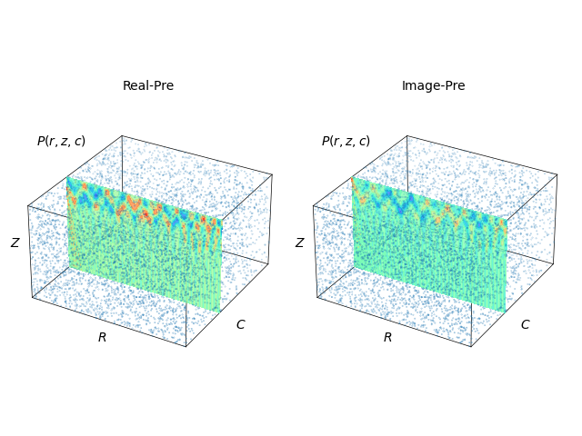
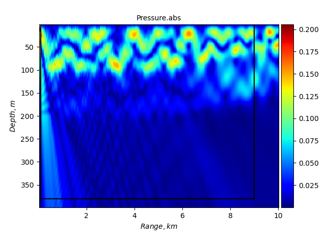
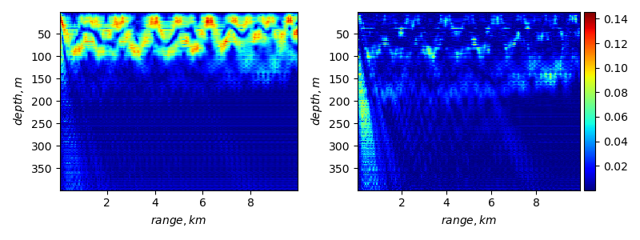

# PDDO-PINN-Helmholtz
# Table of Contents

1. [Overview](#Overview)
2. [Usage](#Usage)
3. [Features](#Features)
4. [Current Issues](#Current-Issues)
5. [Background](#Background)
6. [References](#References)

## Overview
Based on the physical information neural network framework (PINNs) to achieve neural network forecasting of sound field information in water.
~~undone, hopeing i can finish it...~~
## Usage:

Dataset: run Dataset.py to get .pickle and .mat
```
$ DataSet.py
```

My model:
```
$ main.py
```
## Features:
- [x] Create dataset, include complete pressure.
- [ ] Load dataset, random sample dataset.Create Model. 
- [ ] train and test.

## Current Issues: 
It looks like I got the type input wrong, unit and shape are two kind Arg.

*TypeError: Failed to convert object of type <class 'sciann.functionals.variable.Variable'> to Tensor. Contents: <sciann.functionals.variable.Variable object at* *0x7fd4252b18d0>. Consider casting elements to a supported type.* 
<span class="spoiler">Very stupid mistake,and i'm learning keras to correct it...</span>

## Background:  
I get real-pressure and image-pressure by other method.And choose Family with size [7,7].  
>*Governing equations is Inhomogeneous Helmholtz equation*  

<p align="center">
  
  
</p>

If use PINNs: 
<p align="center">
  
</p>

Left is exact pressure, right is different between PINNs predict and exact solution.Obviously there is a learning error at the near source point where the sound pressure is at a lower sound pressure level. I suspect that the use of PDDO to enhance network performance may solve this propagation problem.
## References：
1. Haghighat E, Bekar A C, Madenci E, et al. A nonlocal physics-informed deep learning framework using the peridynamic differential operator[J]. Computer Methods in Applied Mechanics and Engineering, 2021, 385: 114012.
2. Madenci E, Barut A, Dorduncu M. Peridynamic differential operator for numerical analysis[M]. Springer International Publishing, 2019.
3. Madenci E, Barut A, Futch M. Peridynamic differential operator and its applications[J]. Computer Methods in Applied Mechanics and Engineering, 2016, 304: 408-451.

**Thanks to the very powerful framework [SciANN](https://github.com/sciann/sciann) built by Ehsan, I was able to do a little application work on this framework.**

For more details, check out [Ehsan's paper](https://arxiv.org/abs/2005.08803) and the [documentation](SciANN.com).

Ehsan created a [community](https://app.slack.com/client/T010WP0KD39/C010G71GXUJ) to discuss issues.
