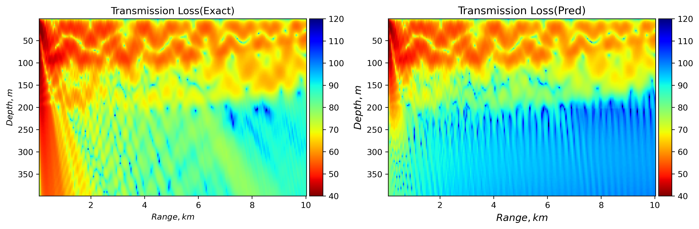

# Sound field information neural network
Sound field information predict with PINNs framwork, in this project i try to use peridynamic differential operator(PDDO)... 
1. PDDO to include nonlocal feature
2. Split-stepping in horizontal direction, VP-PINNs in vertical direction

## Table of Contents

1. [Overview](#Overview)
2. [Usage](#Usage)
3. [Features](#Features)
4. [Current Issues](#Current-Issues)
5. [Background](#Background)
6. [References](#References)

## Overview
~~project undone, hopeing i can finish it...~~  
My project scheduled in "Features".If i finish this project, i'll put features in here.  
I'll put the questions I feel stuck on me in "Current-Issues" and welcome your advice.  
I explain my project simplely in "Background".  

## Usage:

Dataset: run Dataset.py to get .pickle and .mat
```
$ DataSet.py
```

My model:
```
$ main.py
```
## Features:
- [x] Create dataset, include complete pressure.
- [ ] Load dataset, random sample dataset.Create Model. 
- [ ] train and test.

## Current Issues: 
Acoording Ehsan's reply, i'm rewriting my code...
To have multiple features (N units for your inputs, equivalent to nonlocal features), you need to slightly adjust your Variable and use the Field interfaces. Check the example below:
>x = sn.Variable('x', units=Nin)
>y = sn.Functional(
>    sn.Field('y', units=Nout), 
>    x, 4*[100], 'tanh')
then check help(sn.Field) to see some documents.
Then you can apply dot product etc
>w = sn.Variable('w', units=Nout)
>f_nonlocal = sn.dot(y, w)
where w is pre-evaluated weights 


## Background:  
This is because not all points have a large amplitude. Since PINN calculates the loss in a batch, perhaps replacing this batch with the Family calculation will give better results.  
I get real-pressure and image-pressure by other method.And choose Family with size [7,7].  
The point in the 49 black boxes is a batch.
>*Governing equations is Inhomogeneous Helmholtz equation.*  
>Dataset:Figure below is transmission of pressure with range and depth.  
>Ofcourse i split complex pressure in real-part and image-part.So there is two dataset.  

<p align="center">
  
  
</p>
I no longer want to get the exact solution  
>my dataset is also an approximate solution.  
so I train vertically distributed networks and perform a stepwise solution for the one-way propagating sound field.
Here is PINNs results, with *split-stepping method*(or i can't start trainning, LOSS always high): 
<p align="center">
  
</p>

Figure right is error-pointwise,seems to be working with split-stepping.Part of near-field still not work.
It appears that the lower proximity amplitude results in the network not learning the mechanism, but with low loss.

## References：
1. Haghighat E, Bekar A C, Madenci E, et al. A nonlocal physics-informed deep learning framework using the peridynamic differential operator[J]. Computer Methods in Applied Mechanics and Engineering, 2021, 385: 114012.
2. Madenci E, Barut A, Dorduncu M. Peridynamic differential operator for numerical analysis[M]. Springer International Publishing, 2019.
3. Madenci E, Barut A, Futch M. Peridynamic differential operator and its applications[J]. Computer Methods in Applied Mechanics and Engineering, 2016, 304: 408-451.

**Thanks to the very powerful framework [SciANN](https://github.com/sciann/sciann) built by Ehsan, I was able to do a little application work on this framework.**

For more details, check out [Ehsan's paper](https://arxiv.org/abs/2005.08803) and the [documentation](SciANN.com).

Ehsan created a [community](https://app.slack.com/client/T010WP0KD39/C010G71GXUJ) to discuss issues.
